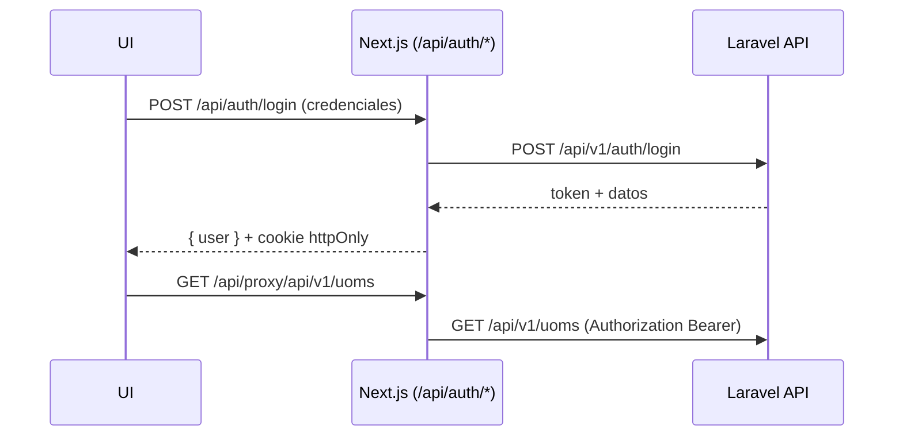

# Guia de uso

Este documento recopila patrones, snippets y mejores practicas para trabajar con el frontend Calameno y extenderlo a nuevos modulos.

---

## 1. Flujo general

1. Configura `.env.local` con `NEXT_PUBLIC_API_BASE_URL` y `AUTH_MODE`.
2. Ejecuta `pnpm dev`.
3. Abre `http://localhost:3000/login` y autenticate.
4. Gestiona unidades (`/uoms`) y productos (`/products`) desde la UI.

> El layout se asegura de que los recursos productivos esten detras de sesion. En modo `bff` se verifica la cookie httpOnly via `middleware.ts`.

---

## 2. Modos de autenticacion

### Directo (localStorage)

```env
AUTH_MODE=direct
```

- `authService.login` recibe `plainTextToken` y lo guarda en el store persistido (localStorage).
- Axios adjunta `Authorization: Bearer token`.
- Ideal para desarrollo rapido o entornos cerrados.

### BFF (proxy + cookie httpOnly)

```env
AUTH_MODE=bff
```

- `POST /api/auth/login` salva el token en la cookie `calameno_token` (httpOnly + Secure) y devuelve el usuario.
- El cliente llama a `/api/proxy/*`, donde Next reinyecta la cabecera `Authorization`.
- `middleware.ts` bloquea acceso sin cookie y redirige a `/login`.

#### Flujo



---

## 3. Servicios y stores

### Base service

```ts
class UomService extends BaseService<"api/v1/uoms"> {
  constructor() {
    super("api/v1/uoms");
  }
}
```

La clase base ya incluye `list`, `show`, `create`, `update`, `patch`, `delete`. Usa el helper de paginacion para armar la query string.

### Uso desde el store Zustand

```ts
const { items, meta } = await uomStore.getState().list({
  page: 1,
  perPage: 10,
  filters: { "filter[name]": searchTerm || undefined },
});
```

Caracteristicas clave:

- TTL configurable (`ttlMs`) por clave de cache.
- Invalidacion seleccionada (`invalidate(key)`) o global.
- Creacion/actualizacion/borrado con **optimistic updates** y rollback ante error.

---

## 4. Formularios con Zod + RHF

```tsx
const schema = z.object({
  name: z.string().min(2),
  category: z.enum(["weight", "volume", "unit"]),
});

const form = useForm<z.infer<typeof schema>>({
  resolver: zodResolver(schema),
  defaultValues,
});

const submit = form.handleSubmit(async (values) => {
  try {
    await create(values);
    toast.success("Guardado");
  } catch (error) {
    const apiError = toApiError(error);
    applyApiErrorsToForm(form, apiError);
  }
});
```

- `applyApiErrorsToForm` replica los errores Laravel (`errors[field]`) en los inputs.
- Los dialogos (`Dialog`) usan `UomForm` y `ProductForm` reutilizable para crear/editar.

---

## 5. Tablas y acciones

```tsx
<DataTable
  columns={columns}
  data={rows}
  total={total}
  page={page}
  perPage={perPage}
  sorting={sorting}
  onSortChange={setSorting}
  onPageChange={setPage}
  onPerPageChange={(value) => {
    setPerPage(value);
    setPage(1);
  }}
  toolbar={toolbar}
/>
```

- `columns` soporta definiciones de TanStack Table con celdas personalizadas y menus Radix.
- `toolbar` aloja filtros (inputs/selects) y acciones (boton "Nuevo").
- El componente gestiona estados de carga (`Skeleton`), vacio y error.

Confirmaciones criticas usan `ConfirmDialog`:

```tsx
<ConfirmDialog
  open={Boolean(pending)}
  onOpenChange={(open) => !open && setPending(null)}
  title="Eliminar producto?"
  onConfirm={handleDelete}
/>
```

---

## 6. Extender a nuevos recursos

1. **Tipos**: agrega `src/types/<recurso>.ts`.
2. **Servicio**: crea `src/services/<recurso>.service.ts` extendiendo `BaseService`.
3. **Store**: copia `uom.store.ts` como base (ajusta TTL y acciones).
4. **Componentes**: replica `ProductForm`/`ProductTable` adaptando campos.
5. **Pagina/App Router**: anade `src/app/<recurso>/page.tsx` envolviendo con `RequireAuth`.

En 10 minutos puedes clonar el patron de productos para "Suppliers" o "Locations".

---

## 7. API cURL de referencia

```bash
# Login
curl -X POST "$NEXT_PUBLIC_API_BASE_URL/api/v1/auth/login" \
  -H "Content-Type: application/json" \
  -d '{"email":"admin@example.com","password":"secret"}'

# Listado de UoM con filtros
curl "$NEXT_PUBLIC_API_BASE_URL/api/v1/uoms?filter[name]=kg&sort=name&page=1&per_page=10" \
  -H "Authorization: Bearer <token>"

# Crear producto
curl -X POST "$NEXT_PUBLIC_API_BASE_URL/api/v1/products" \
  -H "Authorization: Bearer <token>" \
  -H "Content-Type: application/json" \
  -d '{"name":"Azucar 1Kg","baseUomId":1,"category":"dry"}'
```

En modo `bff` utiliza las rutas proxy (`/api/proxy/api/v1/...`) desde el frontend.

---

## 8. Notas finales

- Manten los helpers dentro de `src/lib` para evitar duplicar logica (errores, fechas, paginacion).
- `sonner` se centraliza en `Toaster` y `toast`, evita instancias duplicadas.
- Antes de commitear, ejecuta `pnpm test` y `pnpm lint`.

> ?Necesitas e2e? Anade Playwright apuntando a `/login`, crea fixtures para token y extiende flujos de CRUD. El patron de stores y formularios ya esta preparado para escenarios end-to-end.

